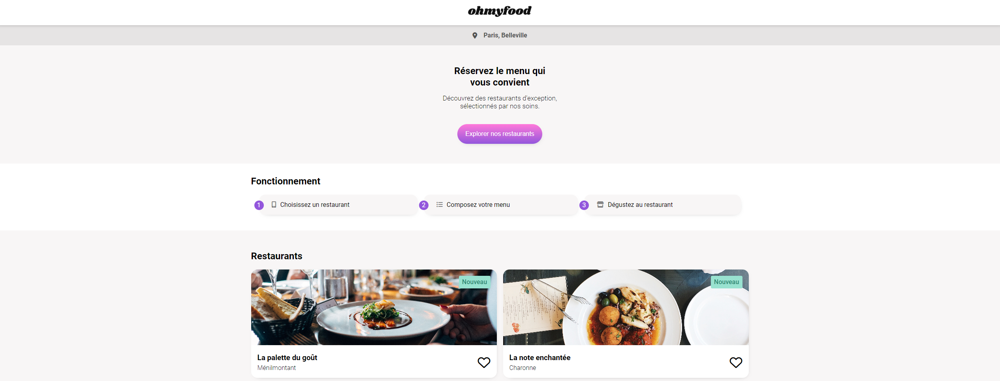

# OHMYFOOD!

![html][html5-badge]

### Description:

Développer un site “mobile first” qui répertorie les menus de restaurants gastronomiques.

### Objectif

- Developper l'application en respectant le design de la [maquette](https://www.figma.com/file/t4449fzDnwGYmzuwQdu87V/Maquettes-Ohmyfood-(mobile-et-desktop)?type=design&node-id=0-1&mode=design).
- Intégrer la version mobile de la page
- Ajouter des animations à la page d'accueil
- Réaliser le responsive
- Intégrer le code des pages des restaurants

## Installation

- Forker puis cloner le repository à l'adresse suivante :
  `git clone https://github.com/afarkhsi/OHMYFOOD`
- Lancer l'application avec l'extension live server

<!-- BADGE LINKS -->

[html5-badge]: https://img.shields.io/badge/HTML5-E34F26?style=for-the-badge&logo=html5&logoColor=white
<!-- [sass-badge]: https://img.shields.io/badge/SASS-E22FE5?style=for-the-badge&logo=sass&logoColor=white -->
[javascript-badge]: https://img.shields.io/badge/JavaScript-F7DF1E?style=for-the-badge&logo=javascript&logoColor=black
